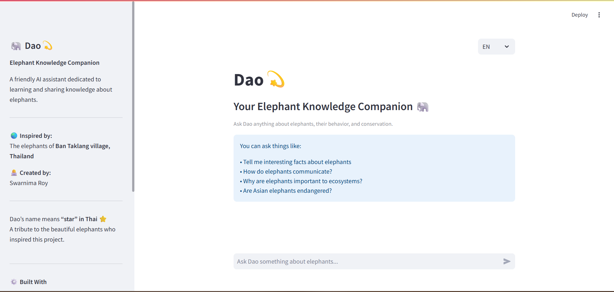
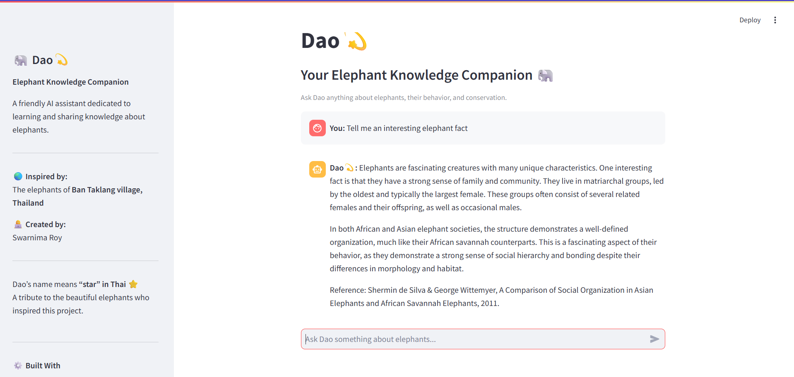
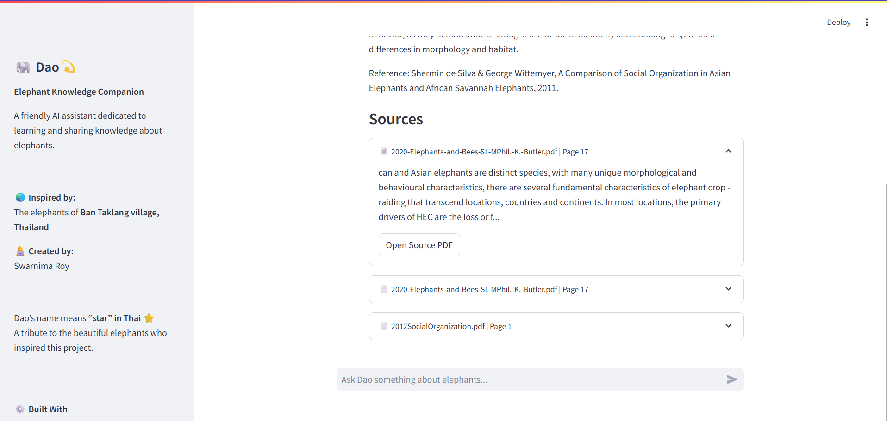

# Dao💫 — Elephant Knowledge Companion (RAG-based AI System)

## 🌟 Project Summary

**Dao💫** is an AI-powered elephant knowledge assistant designed to provide accurate, conversational answers about elephant behavior, ecology, and conservation.

Inspired by a personal experience in Thailand, the project explores how domain-specific AI systems can make learning more engaging and accessible.

It is built using a Retrieval-Augmented Generation (RAG) pipeline, combining a curated knowledge base with a conversational interface to deliver grounded, source-backed responses and handle follow-up questions effectively.

---

## ✨ Features

- 💬 **Conversational AI Interface**  
  Ask natural language questions about elephants and receive clear, engaging responses.

- 🔎 **Retrieval-Augmented Generation (RAG)**  
  Uses a vector database to retrieve relevant knowledge and generate grounded answers.

- 🔁 **Follow-up Question Handling**  
  Maintains conversation context to handle queries like “tell me more” or “expand on point 2”.

- 📚 **Source-backed Responses**  
  Displays document sources and snippets to ensure transparency and trust.

- 🌏 **Multilingual Support (English + Thai)**  
  Supports Thai responses with dynamic translation from English knowledge sources.

- 🧠 **Query Rewriting for Better Retrieval**  
  Improves search quality by converting conversational queries into optimized search queries.

---

## 🧠 Architecture

Dao💫 is built using a Retrieval-Augmented Generation (RAG) pipeline that combines document retrieval with large language model reasoning.

### 🔄 System Flow

1. **User Query**  
   The user asks a question through the Streamlit interface.

2. **Query Processing & Rewriting**  
   The system cleans and rewrites the query to improve retrieval accuracy.

3. **Embedding Generation**  
   The query is converted into a vector embedding.

4. **Document Retrieval (ChromaDB)**  
   The system retrieves relevant document chunks.

5. **Context Construction**  
   Retrieved documents + conversation history are combined.

6. **LLM Response Generation (Mistral via Ollama)**  
   The model generates a grounded response.

7. **Source Attribution**  
   Sources and snippets are displayed with the answer.

---

## 🛠️ Tech Stack

- **Frontend:** Streamlit  
- **Backend:** Python  
- **LLM:** Mistral (via Ollama)  
- **Embeddings:** nomic-embed-text  
- **Vector Database:** ChromaDB  
- **PDF Processing:** PyPDF  
- **Other Tools:** Regex, Custom RAG Pipeline

---

## 📸 Demo

### 🏠 Home Interface

### 💬 Conversational Response

### 📚 Source-backed Answer

---

## ⚙️ How to Run

### 1. Clone the repository
git clone https://github.com/your-username/dao-ai-assistant.git
cd dao-ai-assistant

### 2. Install dependencies
pip install -r requirements.txt

### 3. Run the application
streamlit run dao_app.py

### 4. Run required models (Ollama)
ollama run mistral
ollama run nomic-embed-text